# Cloud Computing and Data Warehousing Project

# Part 1
**1. You creat AWS free tier account.**

**2. Create Keys for AWS CLI.**

AWS CLI Configuration (Access & Secret Keys)

    - To perform operations on AWS, you need to introduce your identity card to the terminal.

    - Go to the IAM Console: Open the "IAM" service via the AWS Console.

    - Select User: Go to the "Users" section in the left menu and select your own user (or create a new one).

    - Generate Keys: Click on the "Security credentials" tab. Under the "Access keys" section, click the Create access key button.

    - Select the CLI Option: Select "Command Line Interface (CLI)" as the usage scenario. Make a note of the generated Access Key ID and Secret Access Key in a secure location (the secret key will not be displayed again!).

**3. Assign Keys via terminal.**
Assignment via Terminal: Open your terminal and type the following command:

    aws configure

It will ask you for your Key ID, Secret Key, region (e.g. eu-central-1) and format (json) in that order.

You can find sample terminal codes and their outputs in the cli-csv-upload.md file.

**4. Create a S3 bucket.**
Now let's create a "cloud folder" for our data.

    aws s3 mb s3://YOUR-BUCKET-NAME

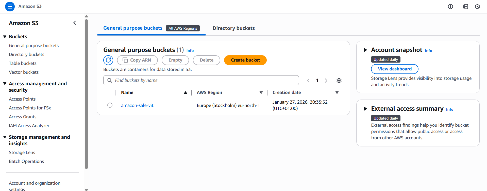

**5. Upload Amazon Sale Report.csv via CLI. Check whether its uploaded.**
- Source: You can download the dataset from Kaggle: Amazon Sales Report Dataset

File Upload: Navigate to the folder containing the CSV file and run the following command:

    aws s3 cp "Amazon Sale Report.csv" s3://YOUR-BUCKET-NAME/landing/

Check:

    aws s3 ls s3://YOUR-BUCKET-NAME/landing/

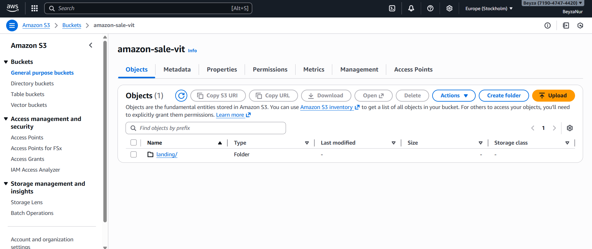

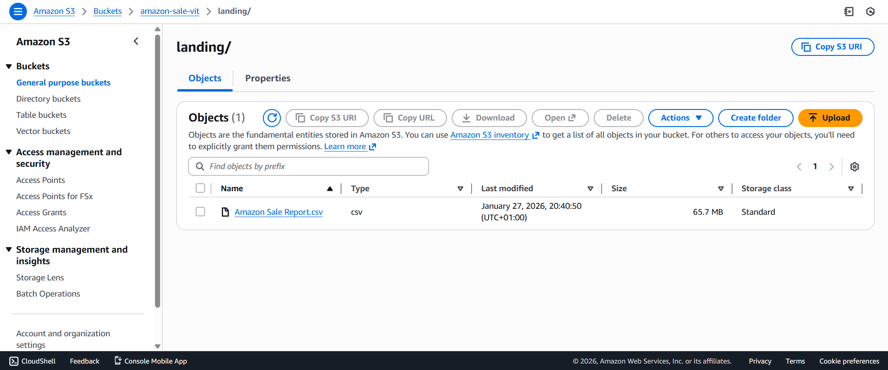

**6. Create a Free Databricks Community Edition Account**

**7. Connect to S3 from the Data Ingestion section in Databricks.**

This way, you can view the data located there as an External Location in Databricks.

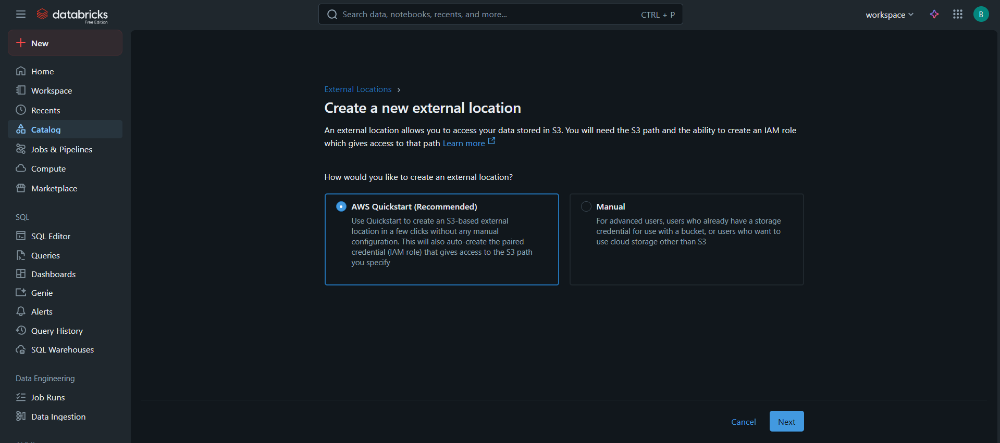

**8. Convert the data located in External Location into a table internally in order to analyse it.**

    CREATE TABLE IF NOT EXISTS amazon_sales_bronze
    USING CSV
    OPTIONS (
        path "s3://amazon-sale-vit/landing/Amazon Sale Report.csv", -- Your external location path
        header "true",
        inferSchema "true"
    );

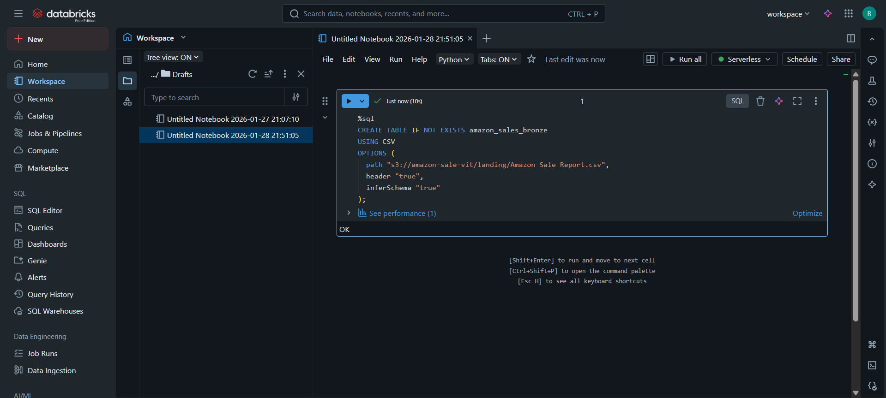

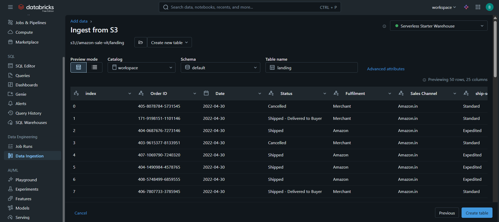

Which category has the highest sales?

    SELECT Category, SUM(Qty) as Total_Qty
    FROM amazon_sales_bronze
    GROUP BY Category
    ORDER BY Total_Qty DESC;

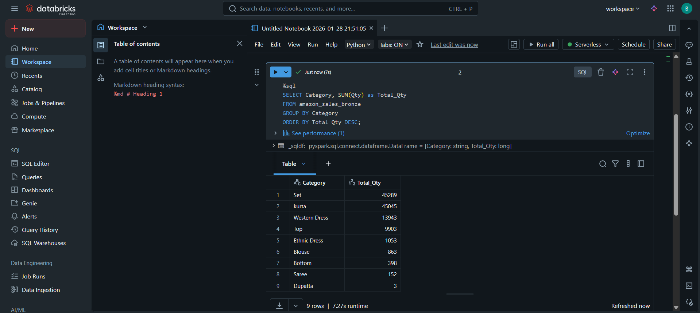

Which state brings the most revenue?

    SELECT `ship-state`, SUM(Amount) as Total_Revenue
    FROM amazon_sales_bronze
    GROUP BY `ship-state`
    ORDER BY Total_Revenue DESC;

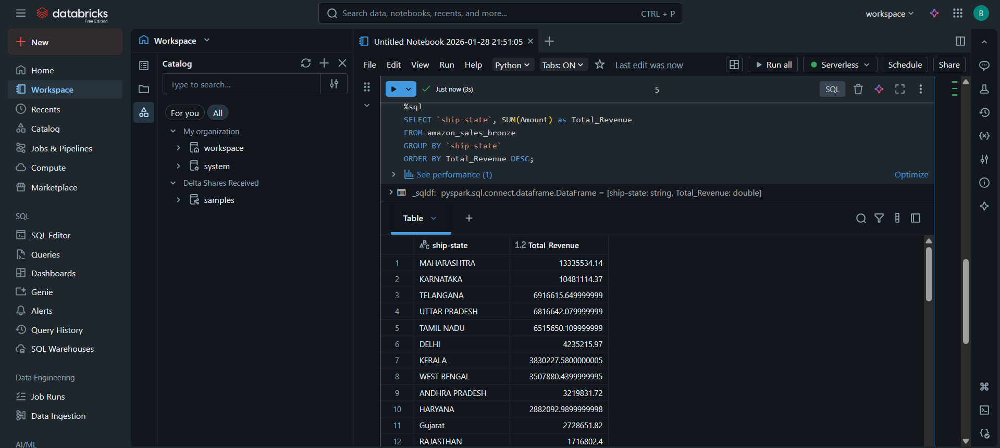

What is the average basket value (Amount / Qty)?

    SELECT AVG(Amount / Qty) as Avg_Basket_Value
    FROM amazon_sales_bronze
    WHERE Qty > 0;

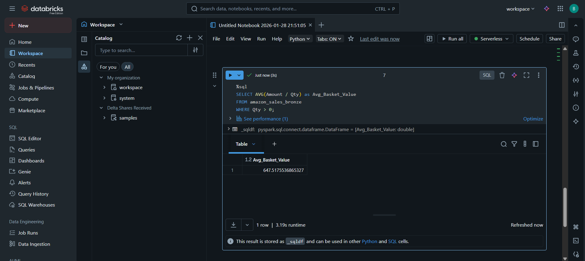

**9. Visualisation (Creating PNGs)**

Immediately below the query results, Databricks offers you a "Visualisation" (+) button.

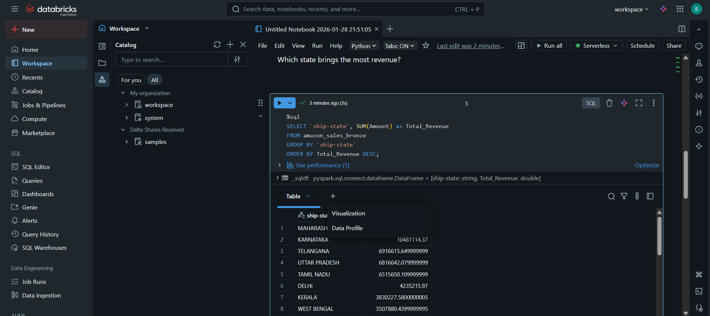

Create a "Bar Chart".

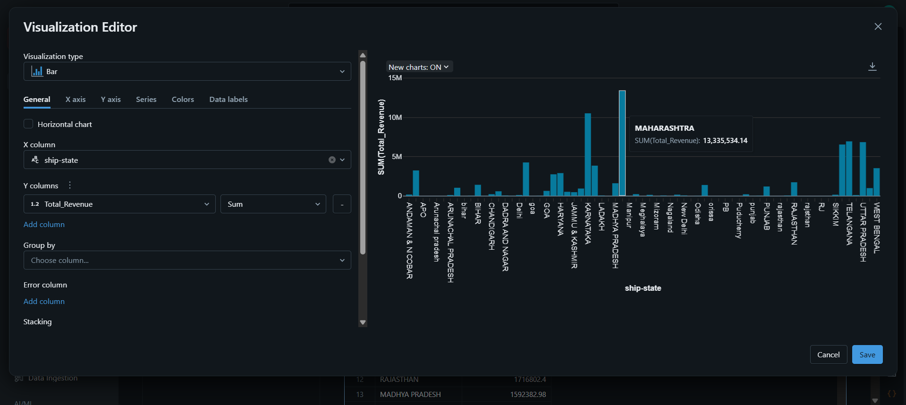

Download the chart to your computer from the "Save" or "Download" section in the top right corner.

# Part 2 Section 1

**Step 1: Create an SNS (Simple Notification Service) Topic.**

1) First, we must establish a "distribution centre" to collect the messages.

2) Go to the SNS service in the AWS Console.
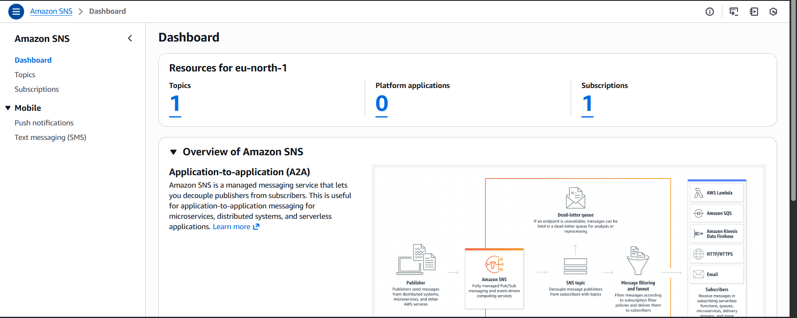

3) Click on the Topics section in the left menu and press the Create topic button.

4) Type: Select "Standard".

5) Name: Name it something like S3-Upload-Notification.

6) Leave everything else as default and click Create topic.

**Step 2: Subscribe to this topic**

1) Now you need to ensure that messages sent to this centre are delivered to your email.
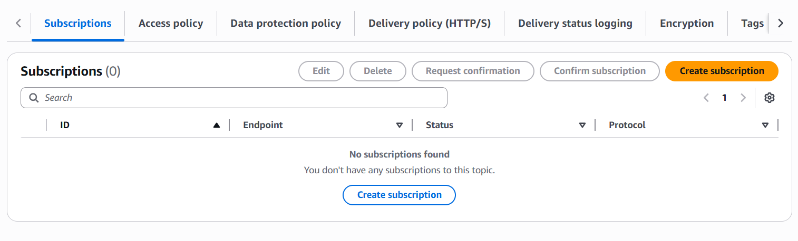

2) While in the topic you created, click the Create subscription button.

3) Protocol: Select "Email".

4) Endpoint: Enter your own email address.

5) Create subscription.

6) IMPORTANT: A confirmation message will be sent to your email. You need to open that email and click the "Confirm Subscription" button. (If you don't, you won't receive notifications!)

**Step 3: Configure the S3 Event Notification**

1) Now we will tell the S3 bucket, "Notify SNS if someone uploads something here".

2) Go to the S3 console and click on your bucket (amazon-sale-vit).

3) Go to the Properties tab.

4) Scroll down to find the Event notifications section and click Create event notification.

5) Event name: NewFileUpload

6) Event types: Only tick the "All object create events" (s3:ObjectCreated:*) option.

7) Destination: Select "SNS Topic" at the bottom.

8) SNS topic: Select the S3-Upload-Notification topic you created in the previous step.

9) Save changes.
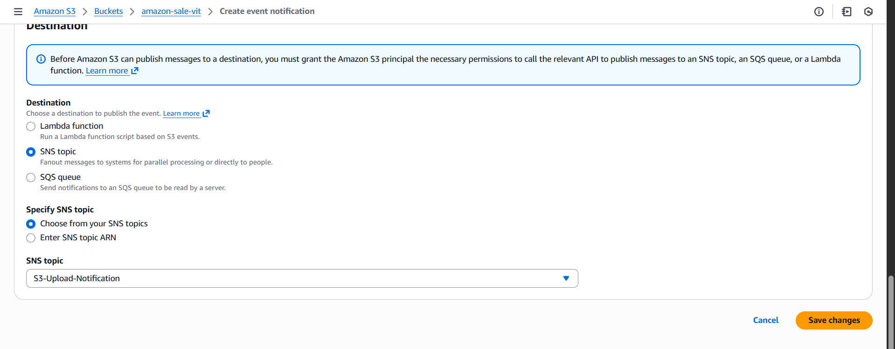

10) If you receive an error: If you receive an "S3 does not have permission" error, you may need to go to the SNS Topic section and allow S3 to send messages here in the "Access Policy" section.

**Step 4: Test it!**

To see if the system is working, go to your terminal (AWS CLI) and upload a small test file or a new image to your bucket (You can upload the images you created in the previous part):

    aws s3 cp "new_test_file.png" s3://amazon-sale-vit/gold/insight/

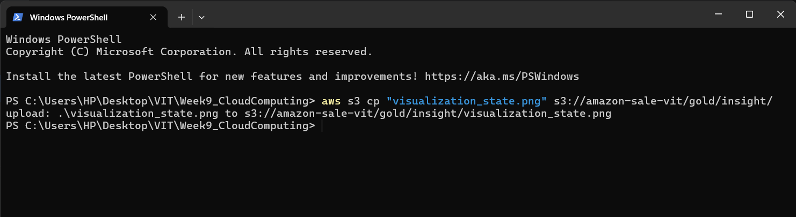
You should receive an email from AWS on your phone or computer within a few seconds!

# Part 2 Section 2

**Step 1: Create the Lambda Function**

1) Go to the Lambda service in the AWS Console and click the Create function button.

2) Function name: S3NotificationFormatter

3) Runtime: Select Python (latest version).

4) Permissions: "Create a new role with basic Lambda permissions"

5) Create function.
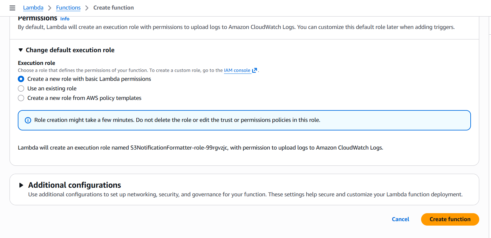

**Step 2: Write the Lambda Code**
Type the following Python code into the code editor on the Lambda screen:

    Python
    import json
    import boto3

    # Launch the SNS client
    sns_client = boto3.client('sns')
    # YOU SHOULD WRITE YOUR OWN SNS TOPIC ARN HERE
    SNS_TOPIC_ARN = "arn:aws:sns:eu-north-1:ACCOUNT_ID_NUMBER:S3-Upload-Notification"

    def lambda_handler(event, context):
        for record in event['Records']:
            bucket_name = record['s3']['bucket']['name']
            file_name = record['s3']['object']['key']
            
            # Create your private message
            subject = "🚀 Amazon Project: New File Uploaded!"
            message = (
                f"Hello,\n\n"
                f"There's been new activity in your S3 bucket!\n"
                f"----------------------------------------\n"
                f"📂 Bucket: {bucket_name}\n"
                f"📄 File: {file_name}\n"
                f"----------------------------------------\n"
                f"This notification was automatically generated by Lambda."
            )
            
            # Send an email via SNS
            sns_client.publish(
                TopicArn=SNS_TOPIC_ARN,
                Subject=subject,
                Message=message
            )
            
        return {
            'statusCode': 200,
            'body': json.dumps('Email sent successfully!')
        }

Note: Do not forget to copy the SNS_TOPIC_ARN section from the SNS page and paste it here. Do not forget to press the Deploy button!

**Step 3: Grant SNS Permissions to Lambda**

Lambda requires permission to send messages to SNS:

Click on the Configuration tab on the Lambda page -> Select Permissions from the left side.

Click on the blue link (role name) under Execution role. This will take you to the IAM page.

Add permissions -> Attach policies

Type AmazonSNSFullAccess into the search box, select it, and click Add permissions.

**Step 4: Update the S3 Trigger**

Now we will ensure that S3 notifies Lambda directly, rather than SNS.

S3 Bucket -> Properties -> Event notifications

Edit the notification you created earlier (or delete it and create a new one to avoid conflicts).

In the Destination section, select Lambda Function instead of "SNS Topic".

From the list that opens, select the S3NotificationFormatter function you just created.

Save.

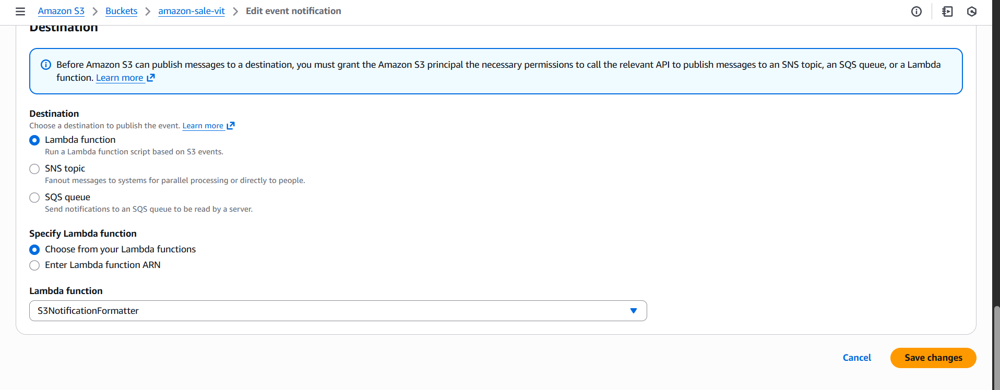

**Step 5 Test Time!**

Go to your terminal and upload any file to S3. This time, when you check your email, instead of the complex JSON message sent by AWS, you will see your own stylish message titled "🚀 Amazon Project: New File Uploaded!".
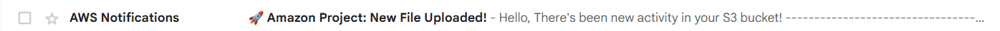

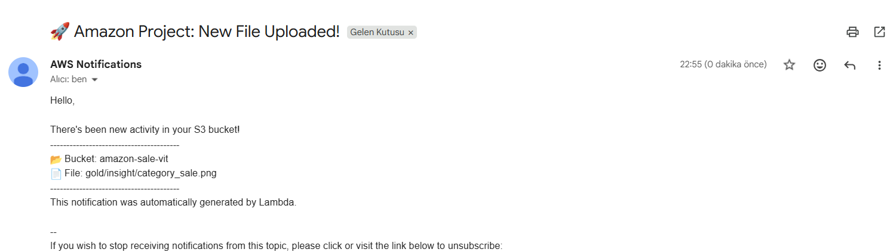

